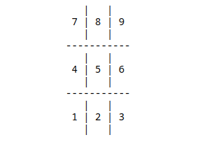

# Tic-Tac-Toe-Python
The game of Tic-Tac-Toe written in python using Jupyter Notebook.
Open the file in a Jupyter Notebook. Then execute all the cells. The numpad is the way to enter the markers. The grid represents the layout of your keyboard numpad. 
Left bottom is 1, top right is 9.

Then follow the prompt along. 
**Enjoy the Game!!!**
